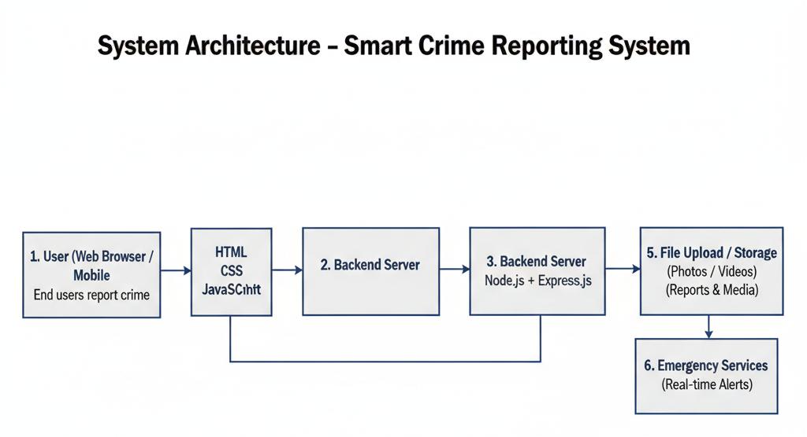
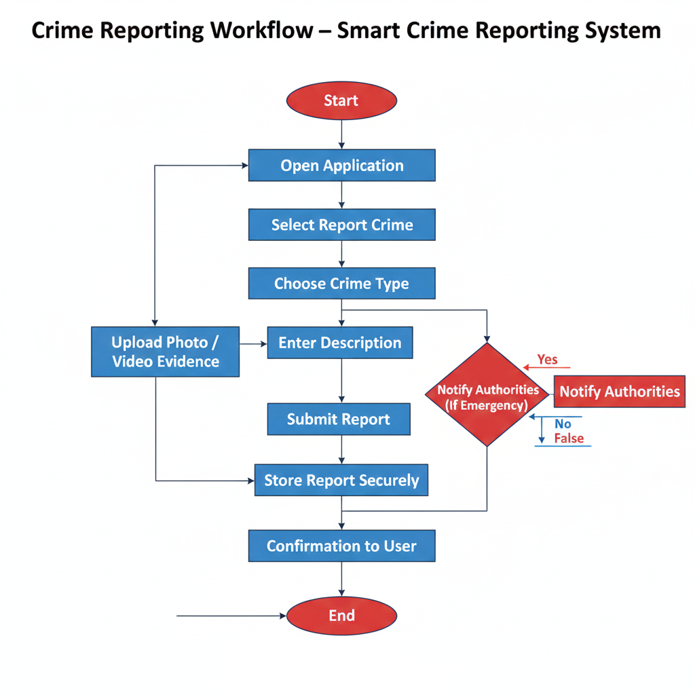
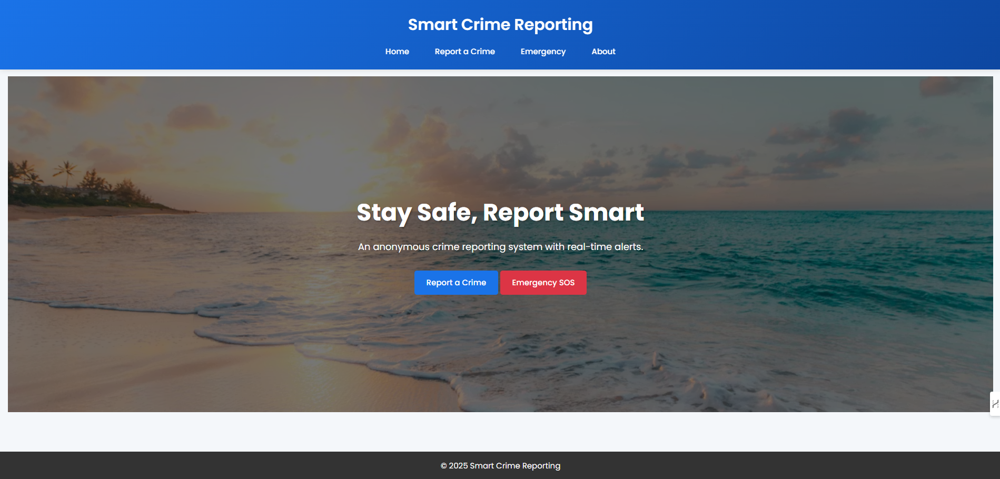
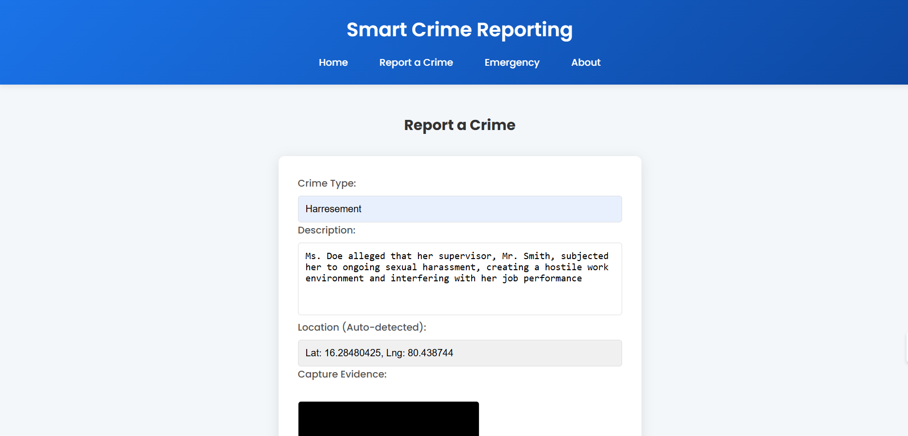
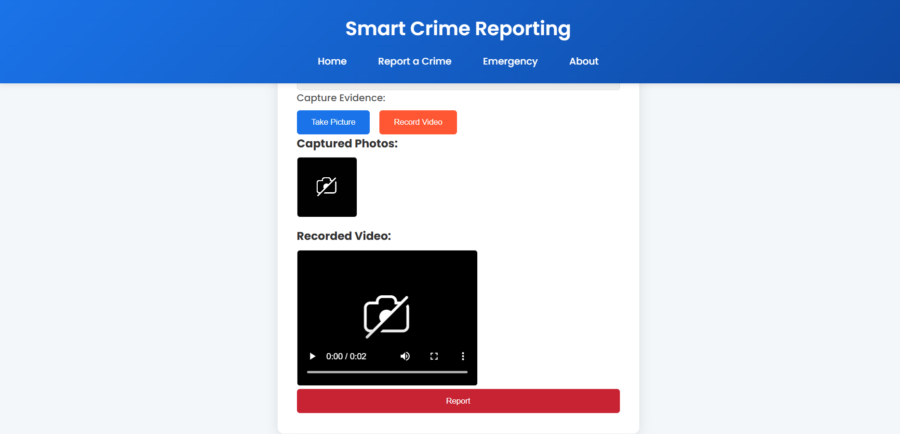
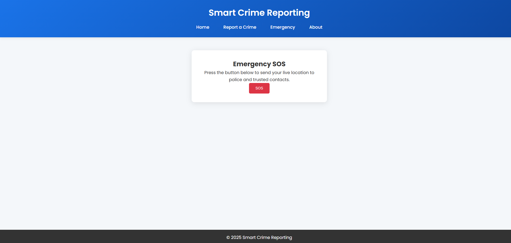

<p align="center">
  
</p>
<h1 align="center">🚨 Smart Crime Reporting System</h1>
<p align="center">
Report Crimes Anonymously • Share Evidence • Enable Faster Response
</p>
<p align="center">
  
  
  
  
  
</p>
<p align="center">A web-based platform that empowers citizens to report crimes safely and anonymously using modern web technologies.</p>

## 🌐 Live Demo

🔗 **Deployed Application:**  
👉 https://smart-crime-reporting.onrender.com

> ⚠️ Note:  
> - Media uploads are stored temporarily (Render free tier limitation)  
> - Camera & location access require HTTPS (already enabled)  
> - Data may reset on redeployment

Feel free to explore the application by submitting a test report or triggering the SOS feature.

## 📌 Table of Contents
- [About the Project](#-about-the-project)
- [Objectives](#-objectives)
- [Key Features](#-key-features)
- [System Architecture](#-system-architecture)
- [Crime Reporting Flow](#-crime-reporting-flow)
- [Demo & Screenshots](#-demo--screenshots)
- [Tech Stack](#-tech-stack)
- [Project Structure](#-project-structure)
- [Setup & Installation](#-setup--installation)
- [Usage Guide](#-usage-guide)
- [Security & Privacy](#-security--privacy)
- [Challenges & Learnings](#-challenges--learnings)
- [Future Enhancements](#-future-enhancements)
- [License](#-license)
- [Authors](#-authors)

## 📖 About the Project
The Smart Crime Reporting System is a web-based application designed to make crime reporting simple, fast, and anonymous.

Many crimes go unreported due to fear, lack of trust, or complex reporting procedures. This system addresses those challenges by allowing users to submit crime reports anonymously, share real-time location data, and upload photo/video evidence directly from their browser.

The project was developed as part of an academic coursework at SRM University, AP, focusing on social impact, usability, and modern web technologies.

## 🎯 Objectives
- Enable anonymous crime reporting to reduce fear of retaliation
- Allow real-time location sharing for faster response
- Support photo and video evidence submission
- Provide an SOS emergency feature
- Build a user-friendly and accessible reporting platform
- Understand full-stack web application development

## ✨ Key Features
### 👤 User Features
- Anonymous crime reporting
- Crime category selection
- Detailed description input
- Automatic location detection (GPS)
- Photo & video evidence upload
- Emergency SOS reporting
- Mobile and desktop responsive UI

### 🛠️ System Capabilities
- Secure file upload handling
- RESTful backend APIs
- Organized report storage
- Real-time data processing

## 🧩 System Architecture
<p align="center">
  
</p>
<p align="center"><i>High-level flow: User → Web Interface → Express Backend → File Storage</i></p>

**Architecture Overview**
- Frontend: HTML, CSS, JavaScript
- Backend: Node.js + Express.js
- Storage: Local file system (reports & uploads)
- APIs: REST-based communication

## 🧭 Crime Reporting Flow
<p align="center">
  
</p>
<p align="center"><i>End-to-end crime reporting workflow</i></p>

**Flow Steps**
1. User opens the application
2. Selects crime reporting or emergency option
3. Fills crime details
4. Captures or uploads evidence
5. Location is auto-detected
6. Report is submitted anonymously
7. Data is stored securely for authorities

## 🎥 Demo & Screenshots
_A visual overview of the Smart Crime Reporting System_

---

### 🏠 Home Page – Safe Entry Point  
**Simple and user-friendly landing interface**

<p align="center">
  
</p>
<p align="center"><i>The homepage provides quick navigation to report crimes, emergency SOS, and platform information</i></p>

---

### 📝 Crime Reporting Form – Anonymous Submission  
**Report incidents securely with detailed information**

<p align="center">
  
</p>
<p align="center"><i>Users can select crime type, describe the incident, and submit reports anonymously</i></p>

---

### 📸 Evidence Capture – Photo & Video Support  
**Attach visual proof to strengthen reports**

<p align="center">
  
</p>
<p align="center"><i>The system allows capturing photos and recording videos directly from the browser</i></p>

---

### 🚨 Emergency SOS – One-Tap Safety Feature  
**Immediate help during critical situations**

<p align="center">
  
</p>
<p align="center"><i>Emergency SOS sends the user's live location to authorities or trusted contacts instantly</i></p>

---

<p align="right">
  (<a href="#-smart-crime-reporting-system">⬆ Back to top</a>)
</p>


## 🛠️ Tech Stack
### Frontend
- HTML5
- CSS3
- Vanilla JavaScript
- Geolocation API
- Media Capture API

### Backend
- Node.js
- Express.js
- Multer (file uploads)
- File System (data storage)

### Tools
- VS Code
- npm
- Browser Developer Tools

## 📂 Project Structure
```text
Smart-Crime-Reporting-System/
├── assets/
│   ├── banner/
│   ├── architecture/
│   ├── flowcharts/
│   └── screenshots/
├── backend/
│   └── server.js
├── css/
│   └── style.css
├── js/
│   └── script.js
├── uploads/
├── reports/
├── index.html
├── report.html
├── emergency.html
├── about.html
├── package.json
└── README.md
```

## ⚙️ Setup & Installation
### Prerequisites
- Node.js (v14+)
- npm
- Modern web browser

### Installation Steps
1. Clone the repository
   ```bash
   git clone <repository-url>
   cd Smart-Crime-Reporting-System
   ```
2. Install dependencies
   ```bash
   npm install
   ```
3. Start the server
   ```bash
   cd backend
   node server.js
   ```
4. Open the application
   - Open `index.html` in your browser

## 🚀 Usage Guide
- Open the application
- Choose Report Crime or Emergency
- Fill details and upload evidence
- Allow location access
- Submit anonymously

## 🔐 Security & Privacy
- Anonymous reporting by default
- Location shared only with user permission
- Media files handled securely
- No personal identity required
- Backend validation before storage

## 🚧 Challenges & Learnings
- Integrating geolocation & camera APIs
- Handling file uploads securely
- Frontend–backend communication
- Debugging async JavaScript issues
- Designing for real-world social impact

## 🔮 Future Enhancements

Although the current system provides core crime reporting functionality, the following enhancements can significantly improve its real-world applicability:

- **User Accounts & Report Tracking**
  - Optional user registration to track submitted reports
  - Status updates (Submitted, Under Review, Action Taken)

- **Admin / Authority Dashboard**
  - Secure login for police or authorities
  - View, filter, and manage crime reports
  - Download uploaded evidence securely

- **Cloud Storage Integration**
  - Store evidence using cloud services (AWS S3, Firebase Storage)
  - Improve scalability and long-term data persistence

- **Real-Time Alerts & Notifications**
  - Email/SMS alerts to authorities on critical reports
  - Push notifications for SOS events

- **Location Mapping & Heatmaps**
  - Visualize crime-prone areas using maps
  - Identify hotspots for preventive action

- **Mobile Application**
  - Android/iOS version for faster reporting
  - Offline reporting with auto-sync

- **AI-Assisted Analysis**
  - Automatic crime categorization
  - Pattern detection for repeated incidents

These enhancements can transform the system from an academic prototype into a production-ready public safety platform.


## 📜 License
MIT

## 👩‍💻 Authors
SRM University, AP — Academic Project Team
